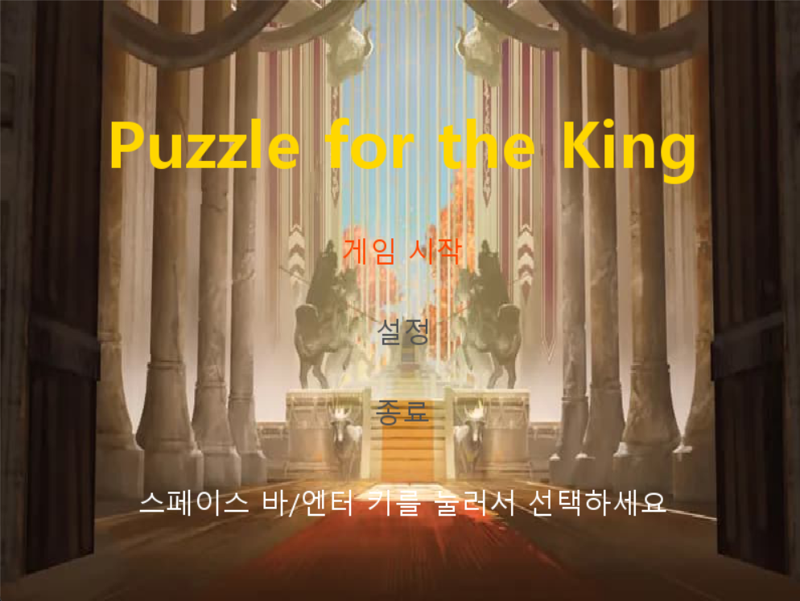
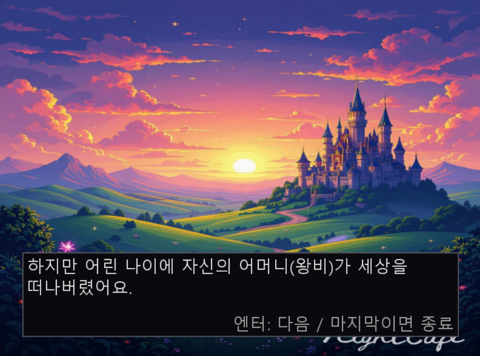
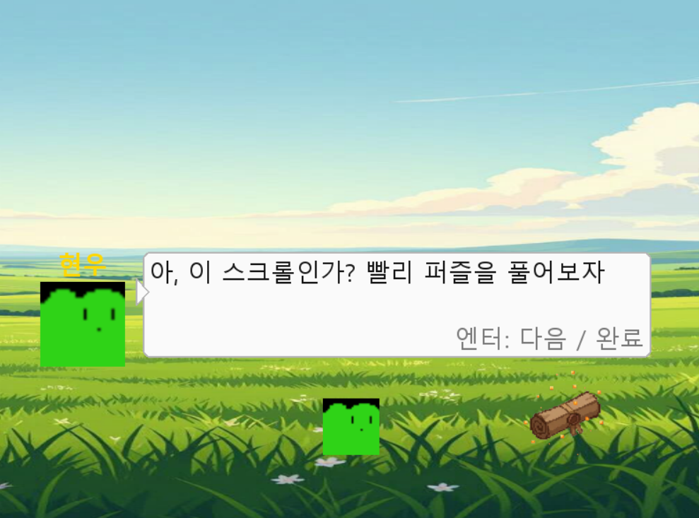
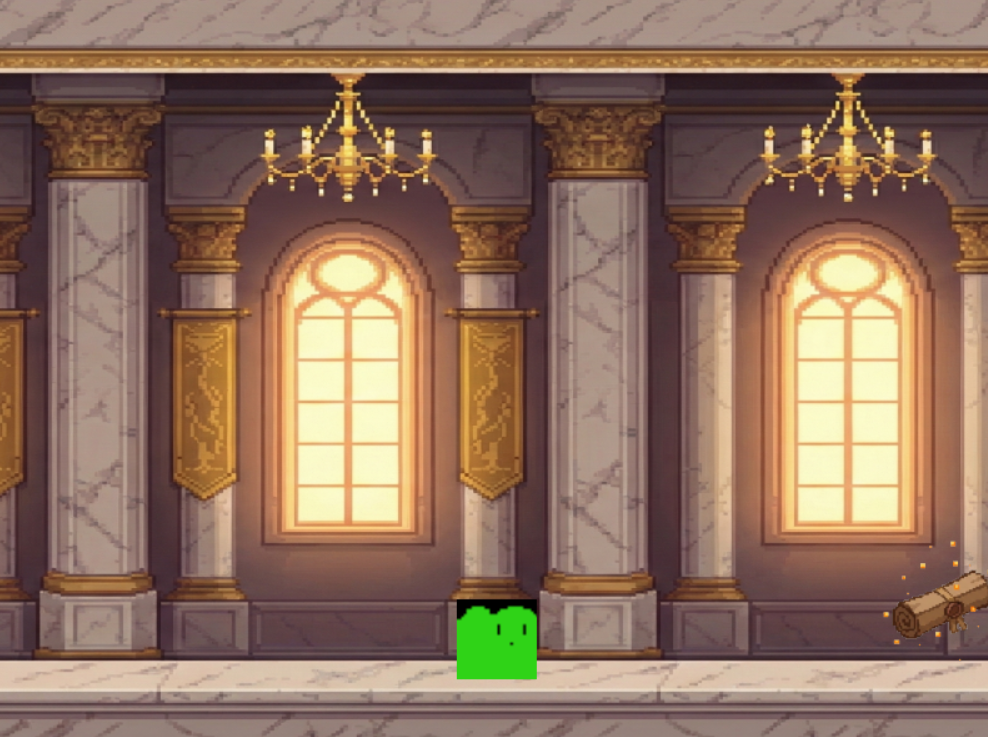
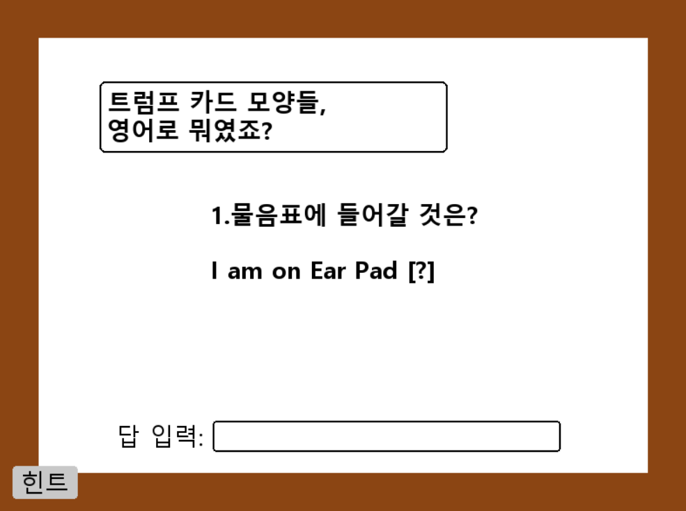
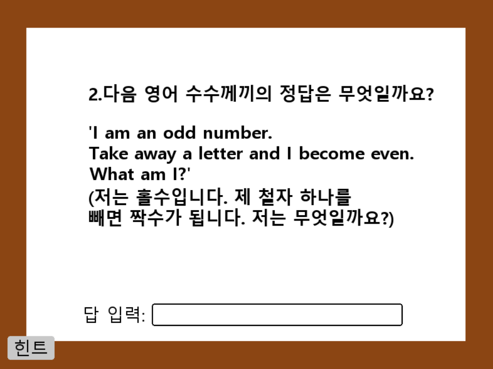
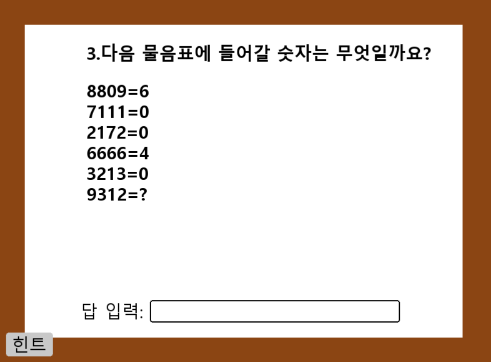
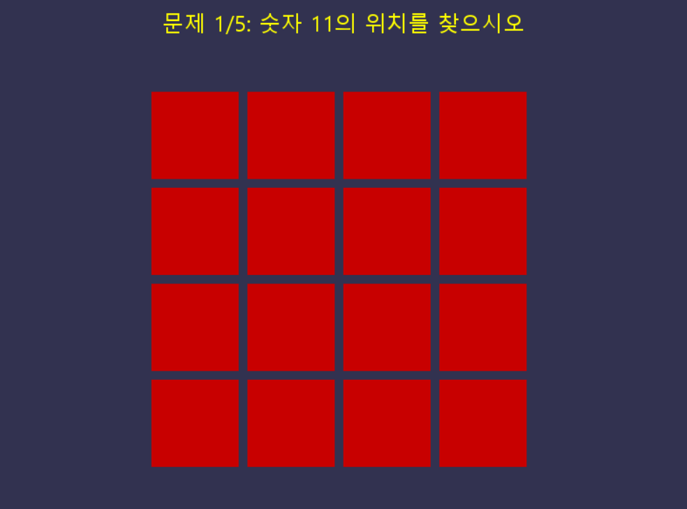
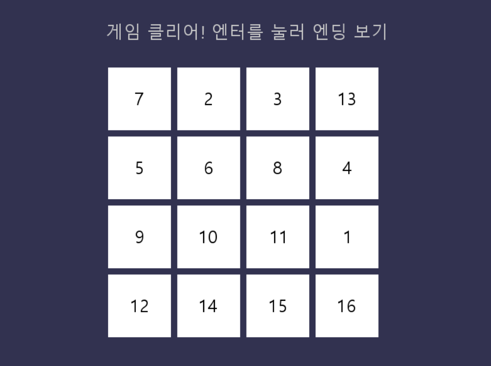
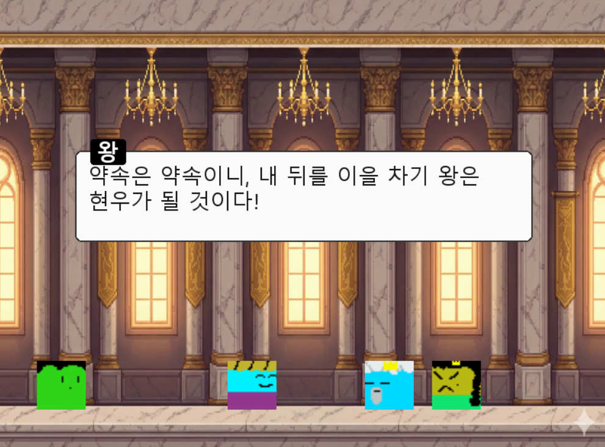

# 👑 네모 왕국의 왕위 계승 (Puzzle for the King)

**주의! 음악 소리가 클 수 있으니 볼륨을 미리 조절해 주세요.**
**화면 비율은 (800X600)입니다. 그 외의 비율로 플레이 할 시 문제가 생길 수 있으니 주의하세요.**

> **"왕실의 퍼즐 코스를 먼저 해결하는 자에게 왕위를 물려주겠다!"**
>
> Python과 Pygame으로 제작한 스토리 기반의 2D 퍼즐 플랫포머 게임입니다.

---

## 📖 프로젝트 소개 (Introduction)

이 게임은 네모 왕국의 왕자 **'현우'**가 되어, 왕위를 노리는 새 왕비와 이복동생의 방해를 이겨내고 진정한 왕이 되기 위해 모험을 떠나는 이야기를 담고 있습니다. 플레이어는 플랫포머 형식의 맵을 탐험하며, 왕이 내린 수수께끼와 퍼즐을 풀어야 합니다.

### 🗝️ 시놉시스 (Story)
1. 어머니를 여의고 새 왕비에게 괴롭힘을 당하던 현우.
2. 병세가 악화된 왕은 두 왕자에게 **'먼저 퍼즐 코스 완주'**를 왕위 계승 조건으로 겁니다.
3. 현우는 방해 공작을 이겨내고 퍼즐을 풀어 왕위를 계승해야 합니다.

---

## 🎮 게임 실행 화면 (Screenshots)

### 🎬 인트로 & 스토리
 

### 🏃 스테이지 이동
 

### 🧩 퍼즐 풀이 (Puzzle)
  
  

### 🏁 엔딩 (Ending)


---

## ⚙️ 주요 기능 및 특징 (Features)

* **스토리텔링:** 인트로, 중간 대화, 엔딩으로 이어지는 기승전결 구조.
* **씬(Scene) 관리:** 타이틀 -> 플레이 -> 퍼즐 -> 엔딩으로 이어지는 매끄러운 화면 전환.
* **조작감:** 부드러운 캐릭터 이동 구현.
* **퍼즐 요소:** 텍스트 입력 방식과 마우스 클릭 방식을 활용한 퀴즈 풀이 시스템.
* **사운드:** 상황에 맞는 BGM 전환 및 효과음(정답, 오답, 엔딩 등) 적용.

---

## 🕹️ 조작법 (Controls)

| 키 (Key) | 기능 (Function) |
| :---: | :--- |
| **←, → (A, D)** | 캐릭터 좌우 이동 |
| **Enter** | 대화 넘기기 / 게임 시작 |
| **키보드 입력** | 퍼즐 정답 입력 |
| **Enter** | 정답 제출 |
| **ESC** | 게임 종료 (엔딩 화면) |

---

## 📂 폴더 구조 (Directory Structure)

```text
Square-Kingdom/
├── assets/             # 게임 리소스 폴더
│   ├── images/         # 캐릭터, 배경, 오브젝트 이미지
│   ├── sounds/         # 배경음악 및 효과음
│   └── screenshots/    # README용 스크린샷
├── scenes/             # 게임 장면별 로직 모음
│   ├── __init__.py     # 패키지 초기화
│   ├── audio.py        # 오디오 매니저 (BGM/효과음 관리)
│   ├── ending.py       # 엔딩 및 크레딧 장면
│   ├── fonts.py        # 폰트 설정
│   ├── options.py      # 설정 화면 (볼륨 조절 등)
│   ├── play.py         # 스테이지 1 (이동 및 대화)
│   ├── play2.py        # 스테이지 2 (이동 및 대화)
│   ├── puzzle.py       # 퍼즐 공통 로직/배경
│   ├── puzzle1.py      # 첫 번째 퍼즐 (퀴즈)
│   ├── puzzle2.py      # 두 번째 퍼즐 (퀴즈)
│   ├── story_intro.py  # 오프닝 스토리 및 인트로
│   └── title.py        # 게임 타이틀 화면
├── main.py             # 게임 실행 파일 (메인 루프)
├── player.py           # 플레이어 클래스 (이동, 점프 로직)
└── README.md           # 프로젝트 설명서
```

## 💡 퍼즐 정답 및 해설 (Puzzle Solutions)
<details>
<summary><strong>👇 정답 보기 (Click to expand)</strong></summary>

**1. 정답: `love`**
* **이유:** **D**iamon**D**, **H**ear**T**, **S**pad**E**, **C**love**R** 트럼프 카드의 상징을 영어로 변환하여 유추합니다.

**2. 정답: `seven`**
* **이유:** `Seven`에서 철자 's'를 빼면 `even`(짝수)이 됩니다.

**3. 정답: `1`**
* **이유:** 각 숫자에 있는 '동그라미의 개수'를 세는 문제입니다. 9에는 동그라미가 1개 있습니다. (8은 2개, 0은 1개, 6은 1개 등)

</details>

## 🎨 이미지 및 리소스 출처 (Image & Assets Credits)

* **배경 이미지 (Backgrounds):** Gemini 및 Nightcafe를 사용하여 AI 프롬프트로 생성했습니다.
* **캐릭터 스프라이트 (Characters):** [Piskel](https://www.piskelapp.com/)을 사용하여 직접 도트를 찍어 제작했습니다.

## 🎵 사용된 음악 및 효과음 (Credits)

이 게임에 사용된 모든 음원의 출처는 다음과 같습니다.

| 사용처 | 곡명 / 설명 | 링크 |
| :--- | :--- | :--- |
| **타이틀 화면** | 미로마을 | [YouTube Link](https://www.youtube.com/watch?v=yqsaHCcsBC8&list=RDyqsaHCcsBC8&start_radio=1) |
| **효과음** | 메뉴 선택/이동 | [SoundEffect-Lab](https://soundeffect-lab.info/sound/button/) |
| **과거 회상** | Super Mario Galaxy - Space Junk Galaxy | [YouTube Link](https://www.youtube.com/watch?v=3Y2T9j9jMPY) |
| **플레이 1** | 포켓몬스터 - 209번 도로 | [YouTube Link](https://www.youtube.com/watch?v=xAiPLJWPBkI) |
| **퍼즐 1** | Super Mario Galaxy 2 - Puzzle Plank Galaxy | [YouTube Link](https://www.youtube.com/watch?v=4sJijxXt_d4) |
| **효과음** | 정답 | [Tistory Link](https://rhdrhd00.tistory.com/36) |
| **효과음** | 오답 | [Esffects](https://esffects.net/ko/231.html) |
| **클리어** | Super Mario Galaxy - Race Win | [YouTube Link](https://www.youtube.com/watch?v=ClBELC8ACPg) |
| **플레이 2** | Zelda Main Theme | [YouTube Link](https://www.youtube.com/watch?v=cGufy1PAeTU) |
| **퍼즐 2** | Super Mario World - Athletic | [YouTube Link](https://www.youtube.com/watch?v=CxKTbcs1t7M) |
| **엔딩 1** | Super Mario 3D World - World 8 Bowser | [YouTube Link](https://www.youtube.com/watch?v=YAYLJ19cxoA) |
| **엔딩 2** | 포켓몬스터 B/W - N의 작별 | [YouTube Link](https://www.youtube.com/watch?v=doyBgqIs7S0) |
| **엔딩 3** | 포켓몬스터 B2/W2 - 부채시티 | [YouTube Link](https://www.youtube.com/watch?v=1HsoH-WNTtw) |
| **효과음** | The End (Final Grand Star) | [YouTube Link](https://www.youtube.com/watch?v=NSUFJHInBGU) |

---

## 📜 라이선스 (License)

이 프로젝트는 **MIT License**를 따릅니다.
(This project is licensed under the MIT License.)

---

**Developed by:** [강지훈]
